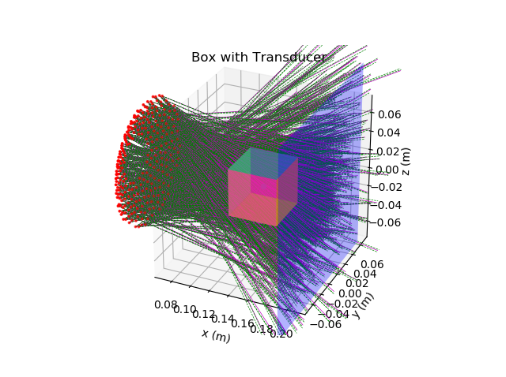

# pyHIFU

HIFU simulation in python, with Trident ray tracing

## Goals

- prove for cubes media and multi-planar media interfaces

## Dependencies

- `numpy`
- `numba`: CUDA and JIT acceleration
- `matplotlib`: for visualization
- `scipy`: for calculating integral
- `cached_property`: faster property access
[https://github.com/pydanny/cached-property](https://github.com/pydanny/cached-property)

## Trident initialization

1. accurate pressure $\hat p$ is calculated from far field approximation using
`pyHIFU.transducer.TElement.ffa` at $len0$ (`pyHIFU.transducer.TElement.distance_z`),
which is the minimal distance that far-field approximation holds.
2. Intensity $I_0={\lvert \hat p\rvert^2}/{2 Z}$
3. Power $P_0=I0 \cdot A$, $A$ is the area formed three intersection points with a plane
perpendicular to power ray at a point, in this case is $len0$.

## HIFU Routine

An example is in [`case1.py`](./case1.py)

1. read the config files (`pyHIFU.io`)
2. Initialize the geometric representation of the media (`pyHIFU.physics.MediaComplex`)
3. Initialize sampling box (`pyHIFU.Box.Box`).
4. For each transducer element, do:

    - set parameters
    - initial casting in lossless or markoil
    - cast initial ray towards `mc` (`MediaComplex`) and sort them according to
    their `bundle_identifier`
    - for each bundle, measure accumulated intensity, phase and counter for each
    `pyHIFU.Box.Cube`
    - calculate complex pressure using
    $pressure = \sqrt{2 Z I_{mean}} \cdot e^{i \phi_{mean}}$
    - return this complex pressure to calling func and free other memories

5. accumulate the complex pressure from all transducers.
6. save the result for further visualization

## Acceleration and parallel computing

python standard module `multiprocessing`

ray tracing using CUDA and `numba.cuda.jit`

## next steps

- test the method on more complex structures such as finite element method mesh-like surfaces in geometric modules

- other methods for a ray to intersect a cube, e.g. the radius of its influence,
intersection with auxilliary rays.
